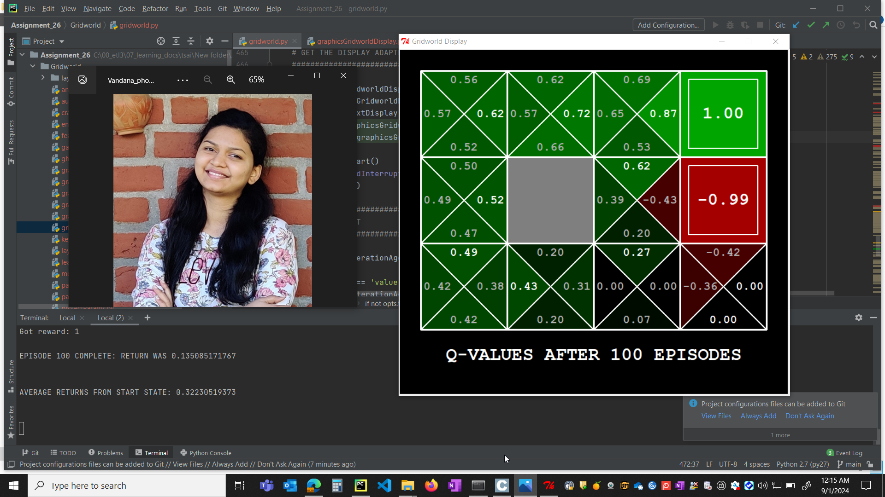

# Assignment 26

# Assignment part 1: Gridworld
## Objective:
To understand Q learning and explain with pseudo code on the working.

## Psuedo Code 

- __init__
    - creates grid template with reward and noise(moving in unintended direction probability) as parameters

- getQValue
    - based on state and action, it returns q value

- computeValueFromQValue
    - This returns state when action is max, considering all possible actions

- computeActionFromQValues
    - This returns an action which gives maximum q values for given state
                    
- getAction
    - returns policy at the state( no exploration happens)

- update
    - This function updates the q values based on state, action, nextState, reward

## Pre requisites:
    python 2.7

## Execution command
Create a python 2.7 virtual environment. Run,
    python Gridworld.py -k 100 -a q -s 10000

## Results

# Assignment part 2: Car Simulation 
        
## Objective:
To Create a map, respective masks and run a car simulation program. The map is custom image(current location) captured from google earth.

## Pre requisites:
- python 3.9
- kivy

## Results

## Description

